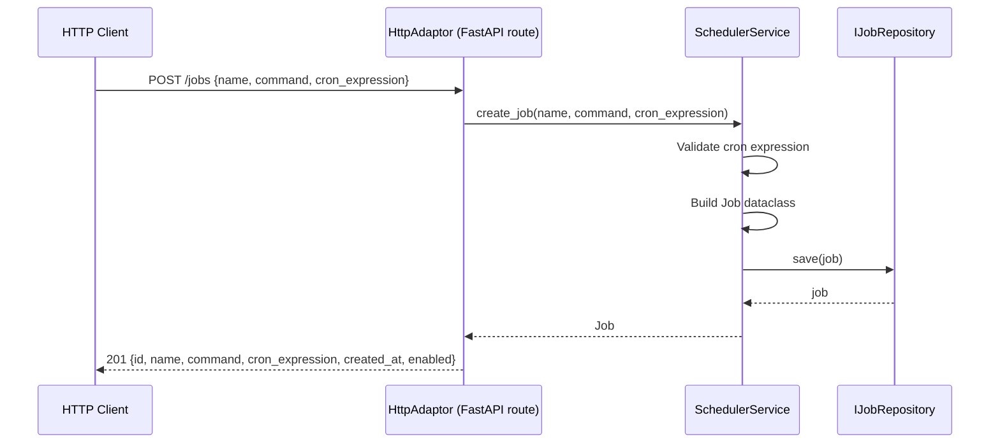
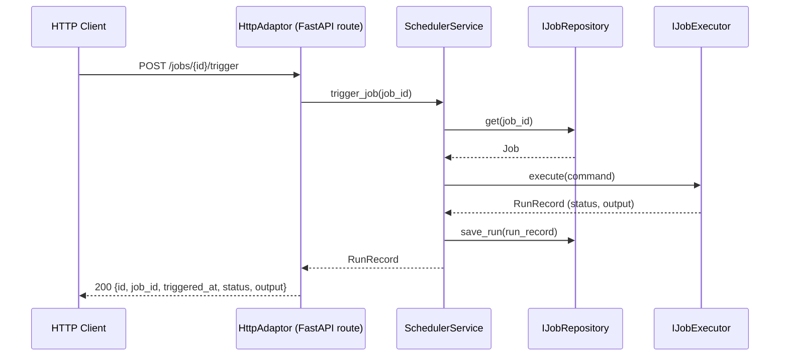
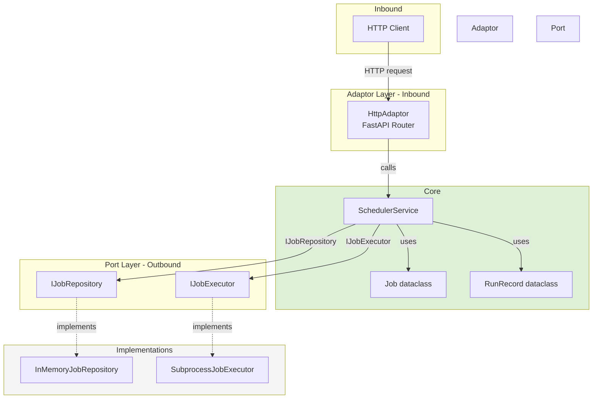
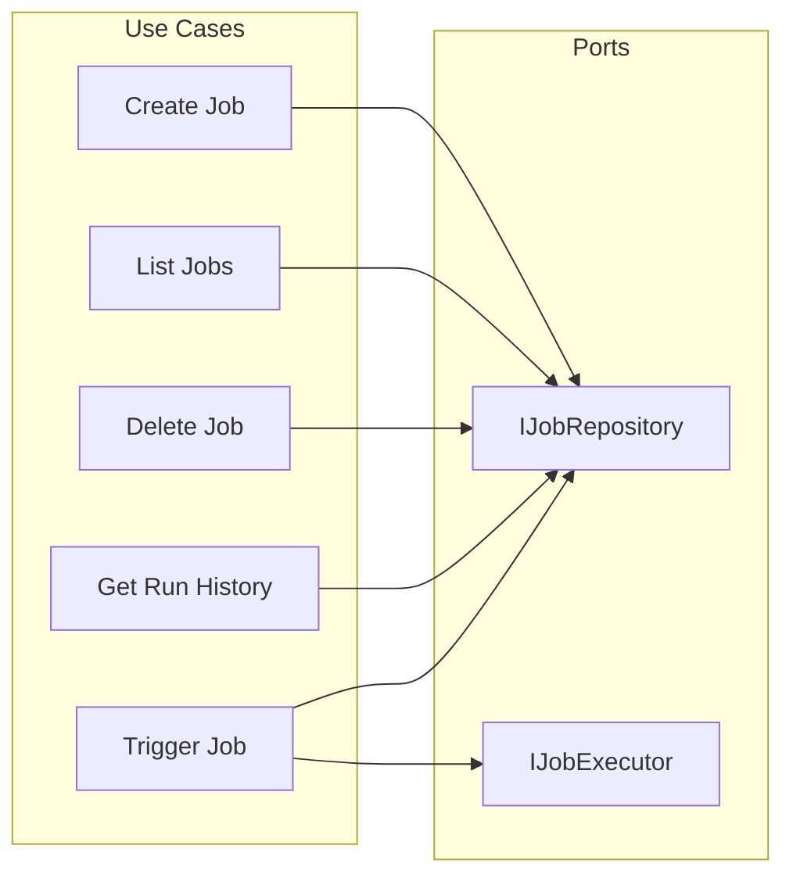

# Crontab Clone — Job Scheduler REST API

A hexagonal-architecture REST API for managing scheduled jobs (crontab-style). Built with FastAPI + uvicorn, tooled with `uv`, tested with `unittest`.

---

## Purpose

Provide a programmable HTTP interface to:
- **Create** a scheduled job (name, command, cron expression)
- **List** all registered jobs
- **Delete** a job by ID
- **View run history** for a job
- **Manually trigger** a job on demand

---

## Architecture

### Hexagonal Layout

```
domain/
  scheduler/
    core/
      job.py                         — Job + RunRecord canonical dataclasses
      scheduler_service.py           — Business logic command handlers
      ports/                         — Outbound: what core reaches out to
        i_job_repository.py          — IJobRepository (abstract)
        in_memory_job_repository.py  — InMemoryJobRepository (concrete)
        i_job_executor.py            — IJobExecutor (abstract)
        subprocess_job_executor.py   — SubprocessJobExecutor (concrete)
      adaptors/                      — Inbound: how outside drives core
        i_http_adaptor.py            — IHttpAdaptor (abstract)
        http_adaptor.py              — HttpAdaptor (FastAPI router, concrete)
main.py                              — Composition root (wires app)
```

### Data Flow — Create Job



### Data Flow — Trigger Job



### Component Architecture



### Use-Case Interactions



---

## API Reference

| Method | Path                   | Description               |
|--------|------------------------|---------------------------|
| POST   | `/jobs`                | Create a scheduled job    |
| GET    | `/jobs`                | List all jobs             |
| DELETE | `/jobs/{job_id}`       | Delete a job              |
| GET    | `/jobs/{job_id}/runs`  | Get run history for a job |
| POST   | `/jobs/{job_id}/trigger` | Manually trigger a job  |

### Create Job — Request Body
```json
{
  "name": "cleanup-logs",
  "command": "find /var/log -name '*.log' -mtime +7 -delete",
  "cron_expression": "0 2 * * *"
}
```

### Job — Response Shape
```json
{
  "id": "3fa85f64-5717-4562-b3fc-2c963f66afa6",
  "name": "cleanup-logs",
  "command": "find /var/log -name '*.log' -mtime +7 -delete",
  "cron_expression": "0 2 * * *",
  "created_at": "2026-03-28T20:00:00Z",
  "enabled": true
}
```

### RunRecord — Response Shape
```json
{
  "id": "7cb85f64-5717-4562-b3fc-2c963f66afa6",
  "job_id": "3fa85f64-5717-4562-b3fc-2c963f66afa6",
  "triggered_at": "2026-03-28T20:05:00Z",
  "status": "success",
  "output": "Deleted 3 files."
}
```

---

## Setup

### Prerequisites
- Python >= 3.14
- [`uv`](https://github.com/astral-sh/uv) installed

### Install

```bash
uv venv
uv pip install -r requirements.txt
```

### Run

```bash
uv run uvicorn main:app --reload
```

API available at `http://localhost:8000`. Interactive docs at `http://localhost:8000/docs`.

### Test

```bash
uv run python -m unittest discover -s tests -p "test_*.py" -v
```

---

## Fixture Layout

```
fixtures/
  raw/
    scheduler/
      v1/
        job.create.request.0.0.1.json       — raw inbound create-job payload
        job.create.response.0.0.1.json      — raw outbound create-job response
        job.list.response.0.0.1.json        — raw outbound list-jobs response
        job.run_history.response.0.0.1.json — raw outbound run-history response
  expected/
    scheduler/
      v1/
        job.create.0.0.1.json               — expected canonical Job fields
        job.list.0.0.1.json                 — expected canonical Job list
        job.run_history.0.0.1.json          — expected canonical RunRecord fields
```

---

## A2A / MCP Notes

- The composition root (`main.py`) is the wiring point — swap `InMemoryJobRepository` for a persistent implementation without touching the domain.
- `IJobExecutor` can be replaced with a sandboxed executor for multi-tenant deployments.
- All canonical models are plain `@dataclass` instances — serializable without framework coupling.
