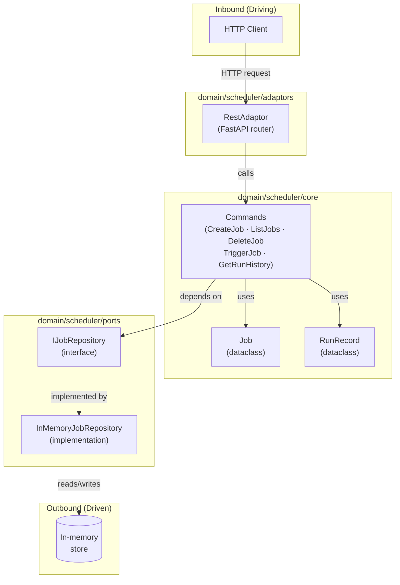
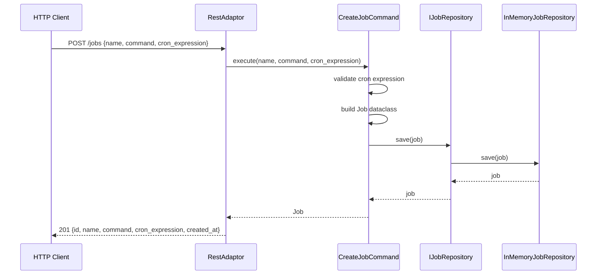

# Crontab Clone — Job Scheduler REST API

A hexagonal-architecture REST API for scheduling and running named jobs on cron expressions.
Built with FastAPI + uvicorn, tested with `unittest`, managed with `uv`.

Lineage: `Agentic-Code-Genotype-main` (AGENTS.md · AI_CONTRACT.md · ADR 0001–0008)

---

## Architecture



---

## Data Flow — Create Job



---

## Endpoints

| Method | Path | Description |
|--------|------|-------------|
| `POST` | `/jobs` | Create a scheduled job |
| `GET` | `/jobs` | List all jobs |
| `DELETE` | `/jobs/{job_id}` | Delete a job |
| `GET` | `/jobs/{job_id}/history` | View run history for a job |
| `POST` | `/jobs/{job_id}/trigger` | Manually trigger a job |

---

## Hexagonal Layout

```
domain/
  scheduler/
    core/
      job.py              — Job canonical dataclass
      run_record.py       — RunRecord canonical dataclass
      commands.py         — Business logic commands
    ports/
      i_job_repository.py — IJobRepository interface (outbound)
      in_memory_job_repository.py — InMemoryJobRepository
    adaptors/
      i_scheduler_adaptor.py — ISchedulerAdaptor interface (inbound)
      rest_adaptor.py        — FastAPI router implementation
main.py                   — Composition root (wires concrete types)
tests/
  scheduler/
    test_core.py          — Tests for Job, RunRecord, commands
    test_ports.py         — Tests for InMemoryJobRepository
    test_adaptors.py      — Tests for RestAdaptor + fixture translations
fixtures/
  raw/scheduler/v1/       — Raw inbound payloads
  expected/scheduler/v1/  — Expected canonical model outputs
```

---

## Setup

```bash
# Create virtualenv and install dependencies
uv venv
uv pip install -r requirements.txt

# Run the API
uv run python -m uvicorn main:app --reload --port 8000

# Run tests
uv run python -m unittest discover -s tests -p "test_*.py"
```

---

## Usage Examples

```bash
# Create a job
curl -X POST http://localhost:8000/jobs \
  -H "Content-Type: application/json" \
  -d '{"name": "daily-backup", "command": "tar -czf /tmp/backup.tgz /data", "cron_expression": "0 2 * * *"}'

# List all jobs
curl http://localhost:8000/jobs

# Manually trigger a job
curl -X POST http://localhost:8000/jobs/<job_id>/trigger

# View run history
curl http://localhost:8000/jobs/<job_id>/history

# Delete a job
curl -X DELETE http://localhost:8000/jobs/<job_id>
```

---

## Cron Expression Format

Standard five-field cron: `minute hour day-of-month month day-of-week`

Examples:
- `* * * * *` — every minute
- `0 2 * * *` — 2 AM daily
- `*/5 * * * *` — every 5 minutes
- `0 9 * * 1` — 9 AM every Monday
