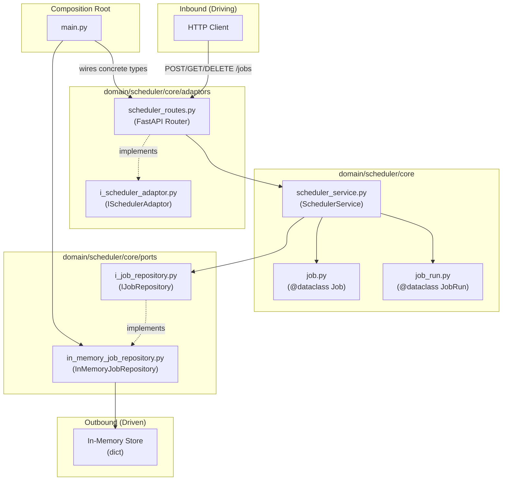
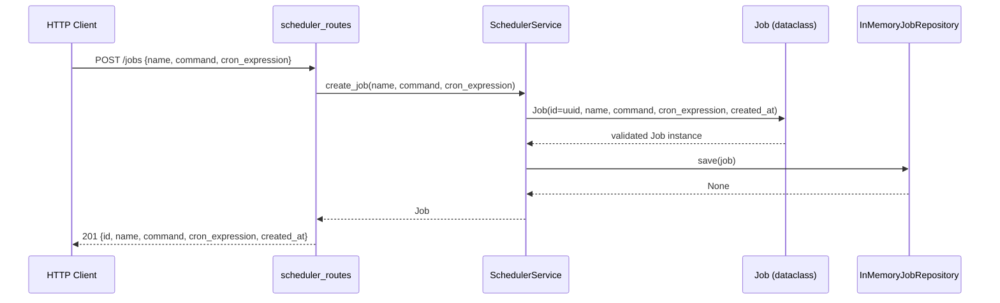
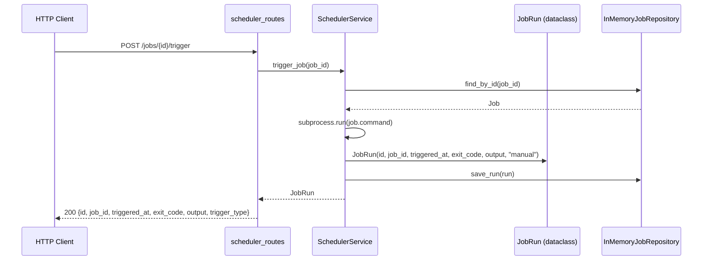

# genotype_crontab_clone_3

A REST API for a job scheduler (crontab clone), built following the Agentic-Code-Genotype hexagonal
architecture conventions.

## Purpose

Expose a JSON HTTP API that lets callers:

- **Create** a scheduled job (name, command, cron expression)
- **List** all jobs
- **Delete** a job
- **View** a job's run history
- **Manually trigger** a job

## Architecture



### Data-flow: Create Job



### Data-flow: Trigger Job



## Folder Layout

```
domain/
  scheduler/
    core/
      job.py                           — Job canonical dataclass
      job_run.py                       — JobRun canonical dataclass
      scheduler_service.py             — business logic
      ports/
        i_job_repository.py            — IJobRepository (outbound interface)
        in_memory_job_repository.py    — in-memory implementation
      adaptors/
        i_scheduler_adaptor.py         — ISchedulerAdaptor (inbound interface)
        scheduler_routes.py            — FastAPI router (inbound implementation)
fixtures/
  raw/scheduler/v1/                    — raw API payload examples
  expected/scheduler/v1/              — expected canonical outputs
tests/
  scheduler/
    test_core.py
    test_ports.py
    test_adaptors.py
main.py                                — composition root (wires all concrete types)
pyproject.toml
requirements.txt
```

## Setup

```bash
uv venv
uv pip install -r requirements.txt
```

## Run

```bash
uv run python -m uvicorn main:app --reload
```

## Test

```bash
uv run python -m unittest discover -s tests -p "test_*.py" -v
```

## API Endpoints

| Method | Path                    | Description               |
|--------|-------------------------|---------------------------|
| POST   | `/jobs`                 | Create a scheduled job    |
| GET    | `/jobs`                 | List all jobs             |
| DELETE | `/jobs/{job_id}`        | Delete a job              |
| GET    | `/jobs/{job_id}/runs`   | View job run history      |
| POST   | `/jobs/{job_id}/trigger`| Manually trigger a job    |

### Create Job — Request Body

```json
{
  "name": "backup",
  "command": "tar -czf /tmp/backup.tar.gz /data",
  "cron_expression": "0 2 * * *"
}
```

### Create Job — Response

```json
{
  "id": "550e8400-e29b-41d4-a716-446655440000",
  "name": "backup",
  "command": "tar -czf /tmp/backup.tar.gz /data",
  "cron_expression": "0 2 * * *",
  "created_at": "2026-03-28T00:00:00+00:00"
}
```

## Genotype Lineage

Parent genotype: `Agentic-Code-Genotype-main`
ADRs applied: 0001, 0002, 0003, 0004, 0005, 0006, 0007, 0008
