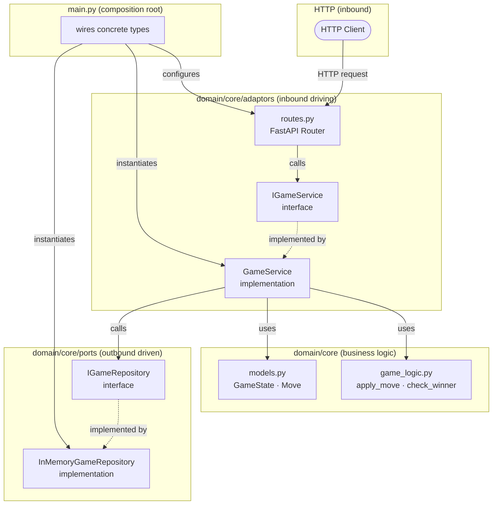
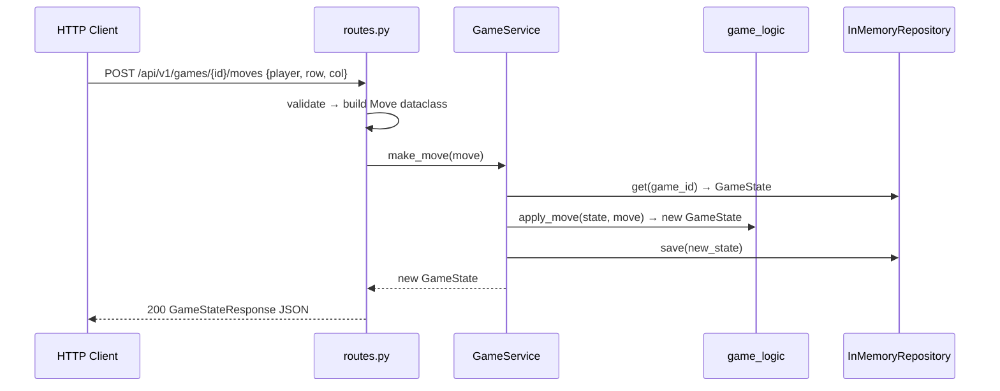

# Tic-Tac-Toe REST API

A two-player tic-tac-toe game served as a REST API.
Built with FastAPI + uvicorn, following the hexagonal architecture genotype.

---

## Purpose

Expose four operations over HTTP:

| Method | Path | Description |
|--------|------|-------------|
| `POST` | `/api/v1/games` | Create a new game |
| `GET` | `/api/v1/games/{game_id}` | Get current game state |
| `POST` | `/api/v1/games/{game_id}/moves` | Make a move |
| `GET` | `/api/v1/games/{game_id}/result` | Get win / loss / draw result |

---

## Architecture



### Data Flow — Make a Move



### Hexagonal Folder Layout

```
domain/
  core/
    models.py              ← canonical @dataclass models
    game_logic.py          ← pure business logic
    ports/
      i_game_repository.py       ← IGameRepository (outbound interface)
      in_memory_repository.py    ← InMemoryGameRepository (implementation)
    adaptors/
      i_game_service.py          ← IGameService (inbound interface)
      game_service.py            ← GameService (implementation)
      routes.py                  ← FastAPI router (HTTP adaptor)
tests/
  game/
    test_core.py           ← GameState · Move · game_logic tests
    test_ports.py          ← InMemoryGameRepository tests
    test_adaptors.py       ← GameService tests (mock repository)
fixtures/
  raw/game/v1/             ← raw inbound request examples
  expected/game/v1/        ← expected canonical model outputs
schemas/
  game_state.json          ← JSON Schema for wire format
main.py                    ← composition root only
pyproject.toml
requirements.txt
```

---

## Setup

```bash
# Create virtual environment
uv venv

# Install dependencies
uv pip install -r requirements.txt

# Run the server
uv run uvicorn main:app --reload --host 0.0.0.0 --port 8000
```

## Run Tests

```bash
uv run python -m unittest discover -s tests -p "test_*.py" -v
```

---

## Example Usage

```bash
# Create a game
curl -X POST http://localhost:8000/api/v1/games

# Make a move (X plays centre)
curl -X POST http://localhost:8000/api/v1/games/{game_id}/moves \
     -H "Content-Type: application/json" \
     -d '{"player": "X", "row": 1, "col": 1}'

# Get game state
curl http://localhost:8000/api/v1/games/{game_id}

# Get result
curl http://localhost:8000/api/v1/games/{game_id}/result
```

---

## Game Rules

- Board is 3×3; cells are `""` (empty), `"X"`, or `"O"`.
- Player `"X"` always moves first.
- A move is rejected if: the cell is occupied, it is not the player's turn, or the game is over.
- `status` values: `active` | `x_wins` | `o_wins` | `draw`.

---

## Lineage

Parent genotype: `Agentic-Code-Genotype-main`
Architecture contract: `AGENTS.md` + `AI_CONTRACT.md`
