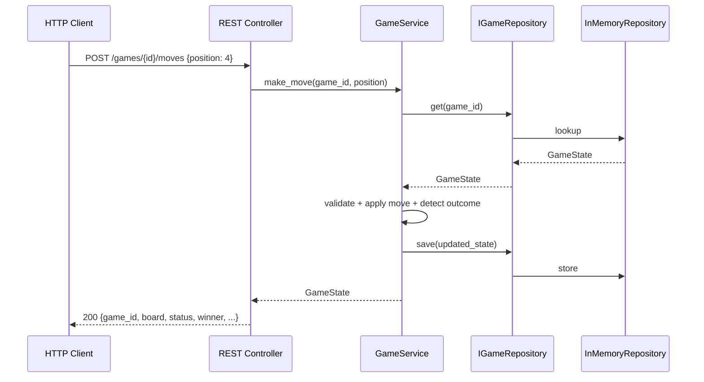

# Tic-Tac-Toe REST API

Two-player tic-tac-toe game served via a FastAPI REST API. Follows the hexagonal (ports-and-adaptors) architecture defined in the Agentic-Code-Genotype lineage.

## Architecture

```mermaid
flowchart TD
    subgraph Inbound["Inbound (driving)"]
        HTTP["HTTP Client\n(curl / frontend)"]
        RC["rest_controller.py\nFastAPI Router"]
    end

    subgraph Domain["domain/game"]
        GS["game_service.py\nGameService"]
        GM["game.py\nGameState @dataclass"]
    end

    subgraph Outbound["Outbound (driven)"]
        IREPO["i_game_repository.py\nIGameRepository (ABC)"]
        INMEM["in_memory_repository.py\nInMemoryGameRepository"]
    end

    subgraph Composition["Composition Root"]
        MAIN["main.py"]
    end

    HTTP -->|POST /games\nPOST /games/{id}/moves\nGET /games/{id}| RC
    RC -->|calls| GS
    GS -->|reads/writes| IREPO
    IREPO -.->|implemented by| INMEM
    MAIN -->|wires| RC
    MAIN -->|wires| GS
    MAIN -->|wires| INMEM
    GS -->|returns| GM
    RC -->|serializes| GM
```

### Data Flow — Make Move



### Hexagonal Folder Layout

```
domain/
  game/                         — primary domain module (business logic + canonical model)
    game.py                     — GameState @dataclass, Player/GameStatus enums
    game_service.py             — GameService (create, move, get, outcome)
    ports/                      — outbound: what the domain needs from outside
      i_game_repository.py      — IGameRepository (ABC)
      in_memory_repository.py   — InMemoryGameRepository (dict-backed)
    adaptors/                   — inbound: how the outside drives the domain
      i_game_controller.py      — IGameController (ABC)
      rest_controller.py        — FastAPI router (HTTPException boundary)
fixtures/
  raw/game/v1/                  — versioned raw request payloads
  expected/game/v1/             — versioned canonical response payloads
tests/
  game/
    test_core.py                — GameState model + GameService logic
    test_ports.py               — InMemoryGameRepository
    test_adaptors.py            — REST controller + fixture round-trips
main.py                         — composition root only
```

## Setup

```bash
uv venv
uv pip install -r requirements.txt
```

## Run

```bash
uv run uvicorn main:app --reload
```

## API Endpoints

| Method | Path | Description |
|--------|------|-------------|
| `POST` | `/games` | Create a new game |
| `GET` | `/games/{game_id}` | Get current game state |
| `POST` | `/games/{game_id}/moves` | Make a move |

### Create a game

```bash
curl -X POST http://localhost:8000/games
```

```json
{
  "game_id": "550e8400-e29b-41d4-a716-446655440000",
  "board": ["", "", "", "", "", "", "", "", ""],
  "current_player": "X",
  "status": "in_progress",
  "winner": null
}
```

### Make a move

```bash
curl -X POST http://localhost:8000/games/{game_id}/moves \
     -H "Content-Type: application/json" \
     -d '{"position": 4}'
```

`position` is a zero-based board index (0–8):

```
0 | 1 | 2
---------
3 | 4 | 5
---------
6 | 7 | 8
```

### Get game state

```bash
curl http://localhost:8000/games/{game_id}
```

### Status values

| Value | Meaning |
|-------|---------|
| `in_progress` | Game is still active |
| `x_wins` | Player X has won |
| `o_wins` | Player O has won |
| `draw` | All cells filled, no winner |

## Tests

```bash
uv run python -m unittest discover -s tests -p "test_*.py"
```
