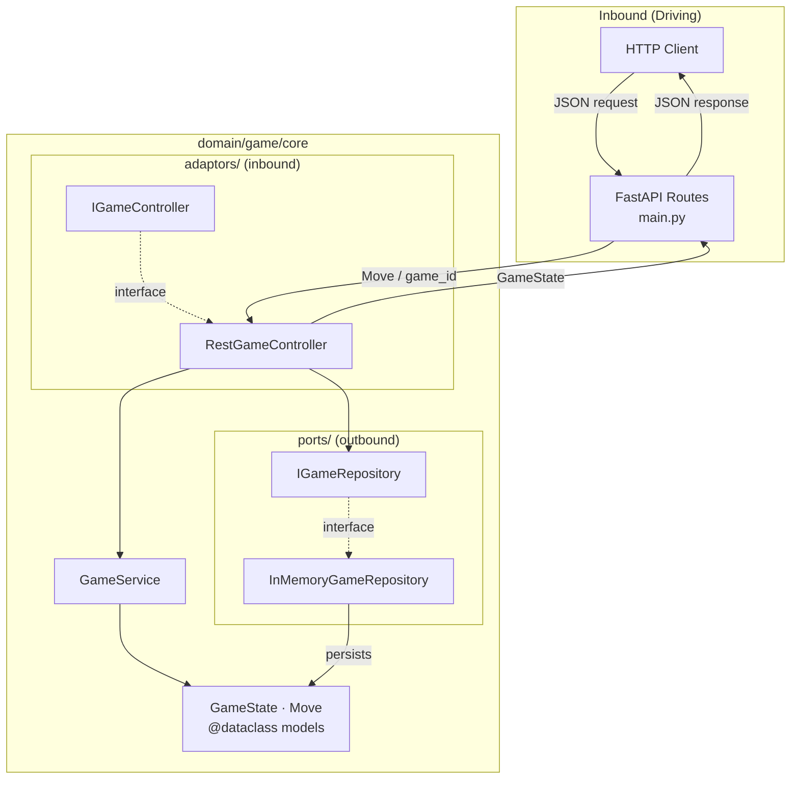
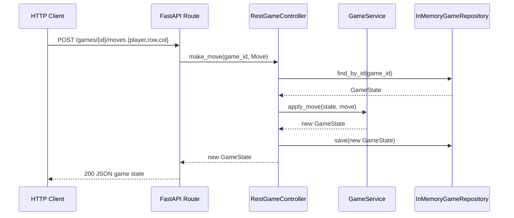

# Genotype Tic-Tac-Toe 3

A two-player tic-tac-toe REST API built with FastAPI, following the hexagonal (ports-and-adaptors)
architecture defined in the Agentic-Code-Genotype lineage.

## Lineage

Parent: `Agentic-Code-Genotype-main` — conventions from `AGENTS.md`, `AI_CONTRACT.md`, and ADRs 0001-0008.

---

## Architecture



### Data Flow — make_move



### Use-Case Interactions

```mermaid
graph LR
    CG[POST /games<br/>create_game]
    MM[POST /games/{id}/moves<br/>make_move]
    GS[GET /games/{id}<br/>get_game]

    CG -->|returns| STATE[GameState]
    MM -->|updates & returns| STATE
    GS -->|returns| STATE

    STATE -->|status| IN[in_progress]
    STATE -->|status| XW[x_wins]
    STATE -->|status| OW[o_wins]
    STATE -->|status| DR[draw]
```

---

## API Endpoints

| Method | Path | Description |
|--------|------|-------------|
| `POST` | `/games` | Create a new game. Returns initial `GameState`. |
| `GET`  | `/games/{game_id}` | Retrieve current game state. |
| `POST` | `/games/{game_id}/moves` | Make a move. Returns updated `GameState`. |

### Create Game

```
POST /games
→ 201 { game_id, board, current_player, status, winner }
```

### Get Game State

```
GET /games/{game_id}
→ 200 { game_id, board, current_player, status, winner }
```

### Make Move

```
POST /games/{game_id}/moves
{ "player": "X", "row": 0, "col": 0 }
→ 200 { game_id, board, current_player, status, winner }
```

#### Status values

| Value | Meaning |
|-------|---------|
| `in_progress` | Game is ongoing |
| `x_wins` | Player X has won |
| `o_wins` | Player O has won |
| `draw` | All cells filled, no winner |

---

## Folder Layout (Hexagonal)

```
domain/
  game/
    core/                   — business logic and canonical models
      models.py             — @dataclass GameState, Move
      game_service.py       — pure business logic
      ports/                — outbound: persistence interface + in-memory implementation
        i_game_repository.py
        in_memory_repository.py
      adaptors/             — inbound: REST controller interface + implementation
        i_game_controller.py
        rest_controller.py
        api_schemas.py      — Pydantic request/response schemas (API boundary only)
tests/
  game/
    test_core.py            — GameService unit tests
    test_ports.py           — InMemoryGameRepository unit tests
    test_adaptors.py        — RestGameController + schema translation tests
fixtures/
  raw/game/v1/              — wire-format JSON inputs
  expected/game/v1/         — expected canonical model outputs
main.py                     — composition root (wires concrete types, defines routes)
pyproject.toml
```

---

## Setup and Run

```bash
# Create virtual environment
uv venv

# Install dependencies
uv pip install -r requirements.txt

# Run the server
uv run uvicorn main:app --reload

# Run tests
uv run python -m unittest discover -s tests -p "test_*.py"
```

Requires Python >= 3.14 and `uv`.

---

## A2A / MCP Notes

- The `IGameController` interface is the inbound contract any agent may drive.
- The `IGameRepository` interface is the outbound contract; swap to a real DB by implementing the interface in a new file under `ports/` and rewiring in `main.py`.
- No agent should reach past the controller into `GameService` directly — always drive through the interface.
