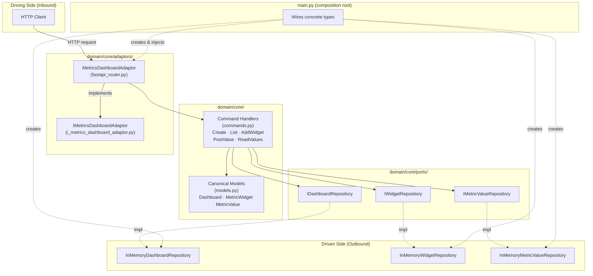
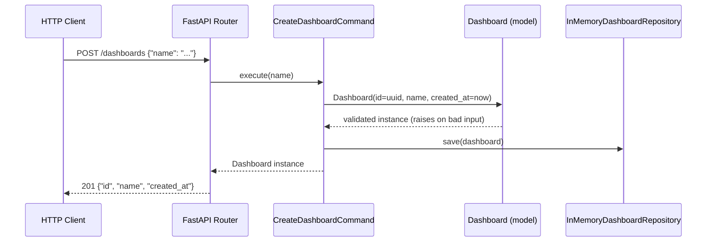
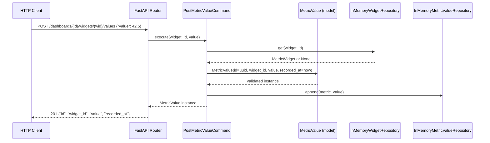
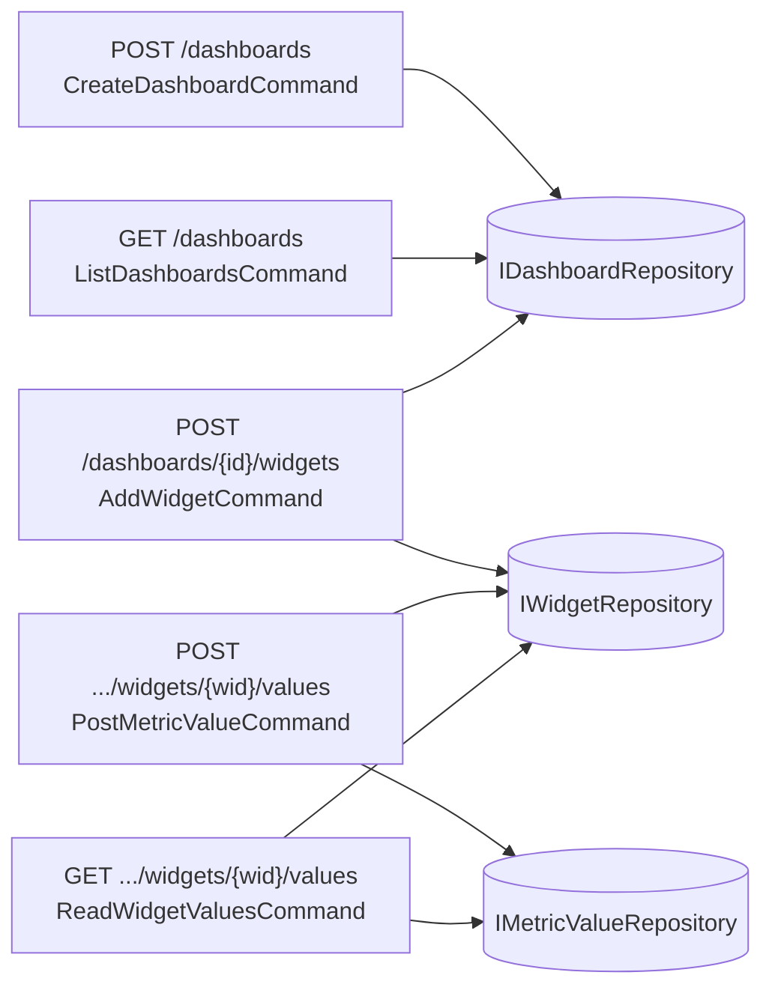

# Architecture

## Hexagonal Overview



## Data Flow — Create Dashboard



## Data Flow — Post Metric Value



## Use-Case Interactions



## Fixture Versioning

```
fixtures/
  raw/
    dashboard/
      v1/
        create_dashboard.0.0.1.json   ← raw POST /dashboards body
        add_widget.0.0.1.json         ← raw POST /widgets body
        post_metric_value.0.0.1.json  ← raw POST /values body
  expected/
    dashboard/
      v1/
        dashboard.0.0.1.json          ← stable canonical Dashboard fields
        widget.0.0.1.json             ← stable canonical MetricWidget fields
        metric_value.0.0.1.json       ← stable canonical MetricValue fields
```
