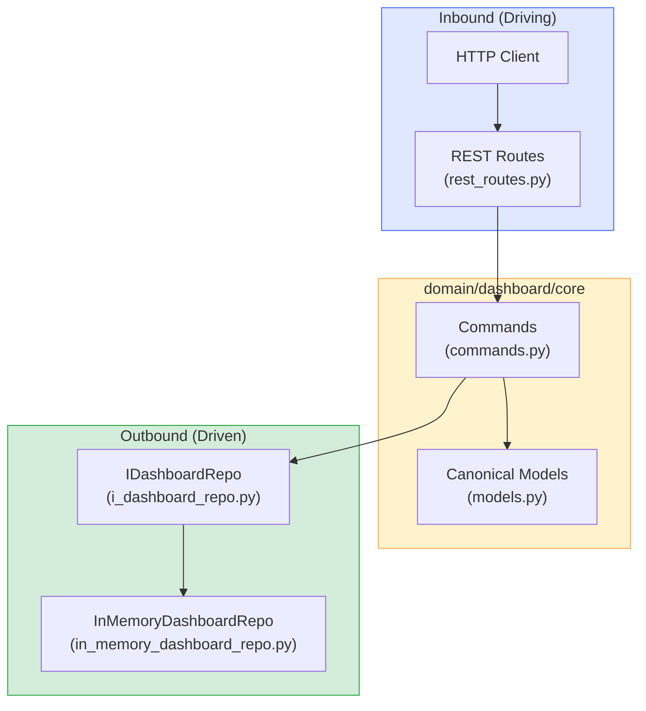
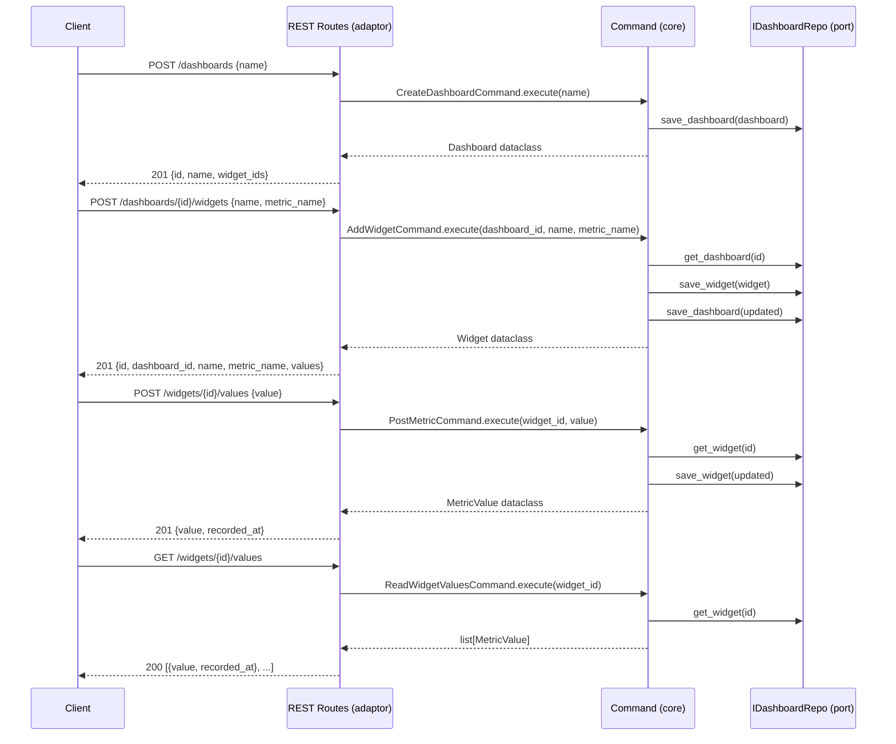

# Metrics Dashboard API

A REST API for a metrics dashboard built with FastAPI, following the hexagonal architecture
genotype defined in `Agentic-Code-Genotype-main`.

## Purpose

Provides five operations:
1. **Create a dashboard** — `POST /dashboards`
2. **List all dashboards** — `GET /dashboards`
3. **Add a metric widget to a dashboard** — `POST /dashboards/{dashboard_id}/widgets`
4. **Post a new metric value to a widget** — `POST /widgets/{widget_id}/values`
5. **Read current widget values** — `GET /widgets/{widget_id}/values`

## Architecture





## Folder Layout

```
domain/
  dashboard/
    core/
      models.py                   — Dashboard, Widget, MetricValue dataclasses
      commands.py                 — CreateDashboard, ListDashboards, AddWidget,
                                    PostMetric, ReadWidgetValues commands
      ports/
        i_dashboard_repo.py       — IDashboardRepo (outbound interface)
        in_memory_dashboard_repo.py
      adaptors/
        i_dashboard_adaptor.py    — IDashboardAdaptor (inbound interface)
        rest_routes.py            — FastAPI router
fixtures/
  raw/dashboard/v1/               — versioned raw request payloads
  expected/dashboard/v1/         — versioned expected canonical outputs
tests/
  dashboard/
    test_core.py
    test_ports.py
    test_adaptors.py
main.py                           — composition root
pyproject.toml
requirements.txt
```

## Setup

```bash
uv venv
uv pip install -r requirements.txt
```

## Run

```bash
uv run python main.py
```

API available at `http://localhost:8000`. Docs at `http://localhost:8000/docs`.

## Test

```bash
uv run python -m unittest discover -s tests -v
```

## Endpoints

| Method | Path | Description |
|--------|------|-------------|
| `POST` | `/dashboards` | Create a dashboard |
| `GET` | `/dashboards` | List all dashboards |
| `POST` | `/dashboards/{dashboard_id}/widgets` | Add widget to dashboard |
| `POST` | `/widgets/{widget_id}/values` | Post a metric value |
| `GET` | `/widgets/{widget_id}/values` | Read widget values |

### Example requests

```bash
# Create dashboard
curl -X POST http://localhost:8000/dashboards \
  -H "Content-Type: application/json" \
  -d '{"name": "Production"}'

# Add widget
curl -X POST http://localhost:8000/dashboards/<id>/widgets \
  -H "Content-Type: application/json" \
  -d '{"name": "CPU Usage", "metric_name": "cpu_percent"}'

# Post metric value
curl -X POST http://localhost:8000/widgets/<id>/values \
  -H "Content-Type: application/json" \
  -d '{"value": 42.5}'

# Read values
curl http://localhost:8000/widgets/<id>/values
```

## Lineage

Parent genotype: `Agentic-Code-Genotype-main`
ADRs followed: 0001, 0002, 0003, 0004, 0005, 0006, 0007, 0008
