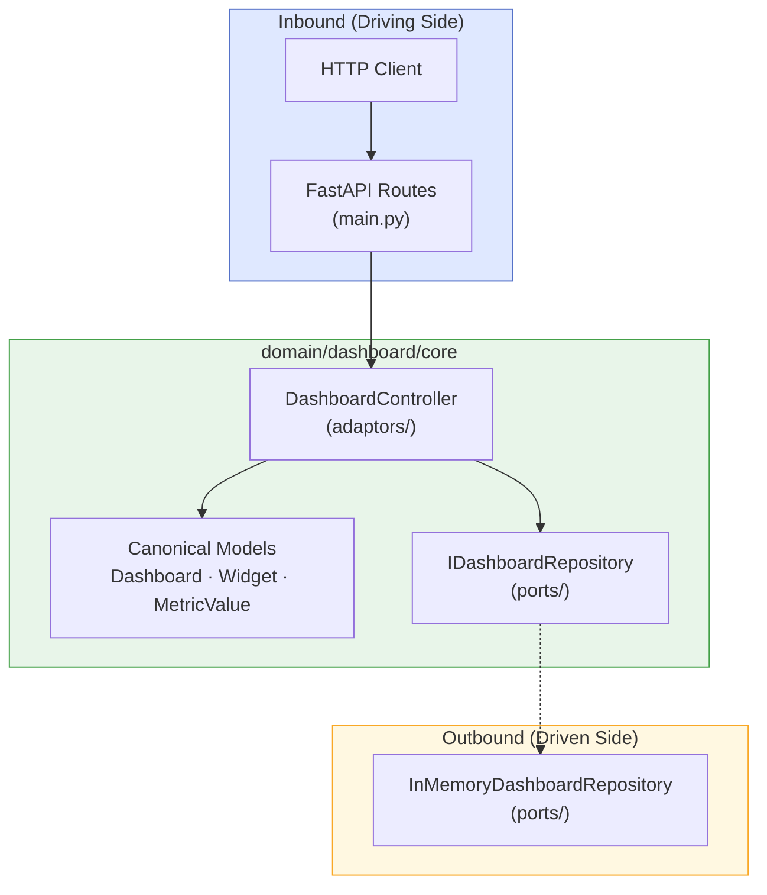
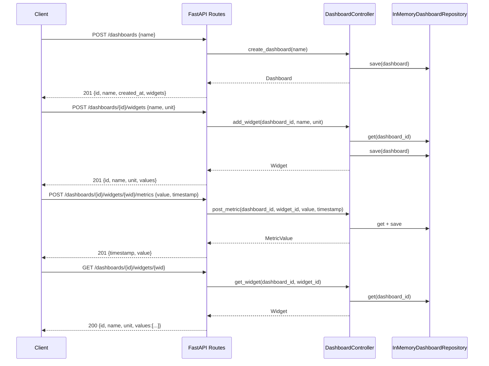

# Metrics Dashboard API

A REST API for managing dashboards and metric widgets, built with FastAPI following the hexagonal (ports & adaptors) architecture defined in the Agentic-Code-Genotype lineage.

## Purpose

Provide a backend service that allows clients to:

- Create named dashboards
- Add metric widgets to dashboards (each widget tracks a named measurement with a unit)
- Post new metric values to widgets over time
- Read the current accumulated values for any widget
- List all known dashboards

## Architecture



### Data-flow diagram



### Folder layout

```
domain/
  dashboard/
    core/
      models.py                          — Dashboard, Widget, MetricValue dataclasses
      ports/
        i_dashboard_repository.py        — IDashboardRepository (outbound interface)
        in_memory_dashboard_repository.py — in-memory implementation
      adaptors/
        i_dashboard_controller.py        — IDashboardController (inbound interface)
        dashboard_controller.py          — use-case orchestrator
main.py                                  — composition root + FastAPI routes
tests/
  dashboard/
    test_core.py                         — canonical model validation
    test_ports.py                        — repository behaviour
    test_adaptors.py                     — controller use-cases (mock repository)
fixtures/
  raw/dashboard/v1/                      — raw incoming request payloads
  expected/dashboard/v1/                 — expected canonical model outputs
schemas/
  dashboard.json                         — JSON schema for wire format validation
```

## Setup

```bash
# Create virtual environment
uv venv

# Activate
source .venv/bin/activate

# Install dependencies
uv pip install -r requirements.txt
```

## Running

```bash
uv run python -m uvicorn main:app --reload --port 8000
```

API docs available at `http://localhost:8000/docs` (Swagger UI).

## Running Tests

```bash
uv run python -m unittest discover -s tests -p "test_*.py" -v
```

## API Endpoints

| Method | Path | Description |
|--------|------|-------------|
| `POST` | `/dashboards` | Create a dashboard |
| `GET` | `/dashboards` | List all dashboards |
| `POST` | `/dashboards/{id}/widgets` | Add a widget to a dashboard |
| `POST` | `/dashboards/{id}/widgets/{wid}/metrics` | Post a metric value to a widget |
| `GET` | `/dashboards/{id}/widgets/{wid}` | Read current widget values |

## Lineage

Parent genotype: `Agentic-Code-Genotype-main`
Conventions: AGENTS.md · AI_CONTRACT.md · ADR 0001–0008
